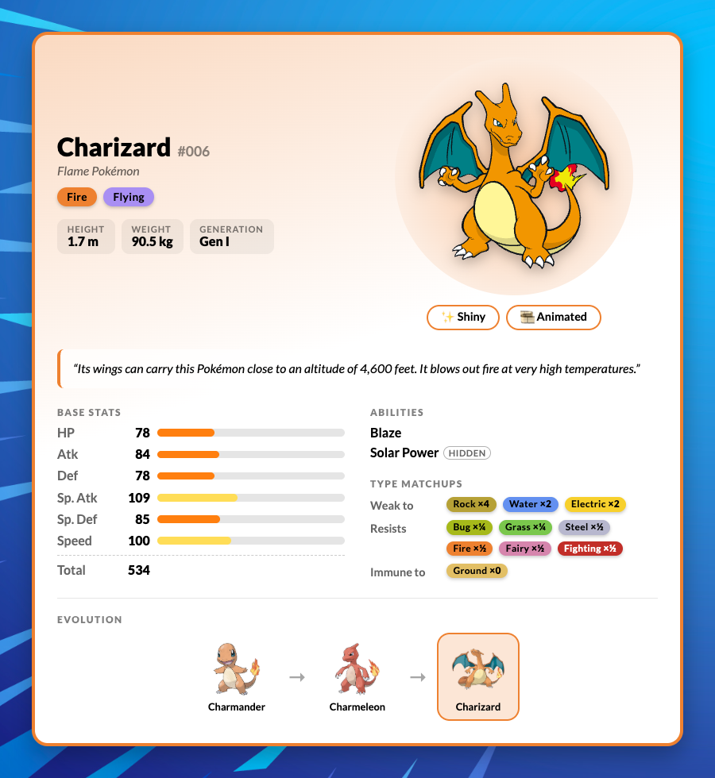

# 🐾 Search Your Pokémon 🎮

Welcome to **Search Your Pokémon**, a Pokédex built with **React** and the [PokéAPI](https://pokeapi.co/)! Search any Pokémon to see its stats, type matchups and evolutions, or play a quick round of *Who's that Pokémon?* 📸✨

🔗 **Live demo:** [js-search-your-pokemon.netlify.app](https://js-search-your-pokemon.netlify.app)

---

## 🌟 Features

### 🔎 Search
- Autocomplete with sprites as you type, by name or Pokédex number (`25`, `#025`).
- 🎲 Random Pokémon button.
- Shareable links: every search updates the URL (`?pokemon=pikachu`), and back/forward navigation works.

### 📇 Pokémon card
- Colors based on the Pokémon's main type.
- Pokédex number, category, height, weight, generation and Legendary/Mythical badges.
- Pokédex description.
- Base stats with bars and total.
- Abilities, including hidden ones.
- Type matchups: weaknesses, resistances and immunities, combined for dual types.
- Clickable evolution chain, including branches like Eevee's.
- ✨ Shiny and 🎞️ animated sprites.
- Plays the Pokémon's cry when it's found.

### 🏠 Home widgets
- 📅 **Pokémon of the Day**: the same Pokémon for everyone, changing every day.
- ❓ **Who's that Pokémon?**: guess the Pokémon from its silhouette, with a streak and best score.

### ♿ Accessibility & responsiveness
- Works on desktop, tablet and mobile.
- Keyboard navigation, visible focus and screen reader labels.
- Respects the system's "reduce motion" setting.
- Caches API data in the browser, as PokéAPI recommends.

---

## 🚀 Technologies Used
- ⚛️ **React** and **Vite** for building the user interface.
- 🧭 **React Router** for shareable URLs.
- 🔽 **Downshift** for the accessible autocomplete.
- 🎨 **Sass** for styling and responsiveness.
- 📡 **PokéAPI** for Pokémon data, sprites and cries.

---

## 🖥️ Preview
Here's a glimpse of what the application looks like:




---

## 🛠️ Running Locally
```bash
npm install
npm run dev
```

Then open [http://localhost:5173](http://localhost:5173). To create a production build, run `npm run build`.

---

## 🧑‍💻 Author
Made with ❤️ by [João Campos](https://github.com/camposjoaoc). Feel free to reach out!

---

## 📜 License
This project is licensed under the MIT License. See the [LICENSE](./LICENSE) file for details.

---

## 🌈 Acknowledgments
Special thanks to the team at [PokéAPI](https://pokeapi.co/) for making this project possible, and to [Pokémon Showdown](https://pokemonshowdown.com/) for the animated sprites. 🎉

---

✨ **Have fun searching your Pokémon!** 🕹️
